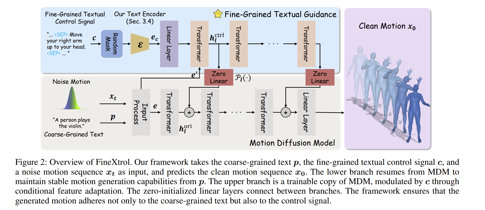
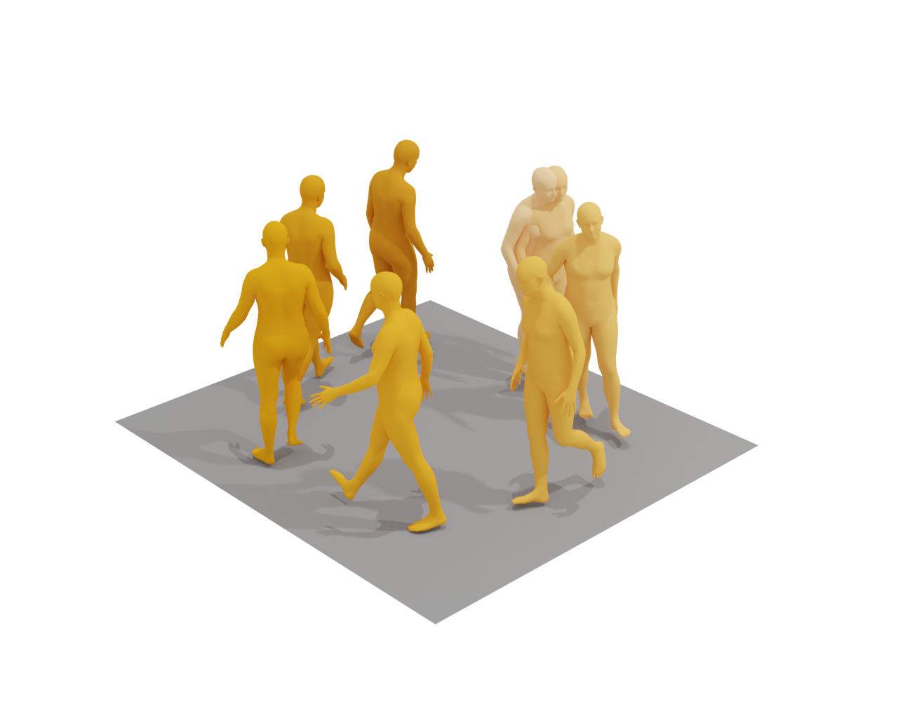
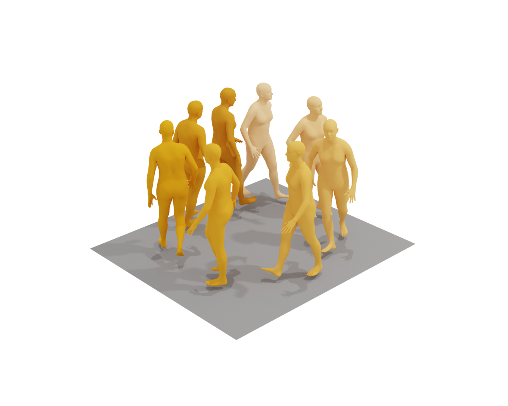
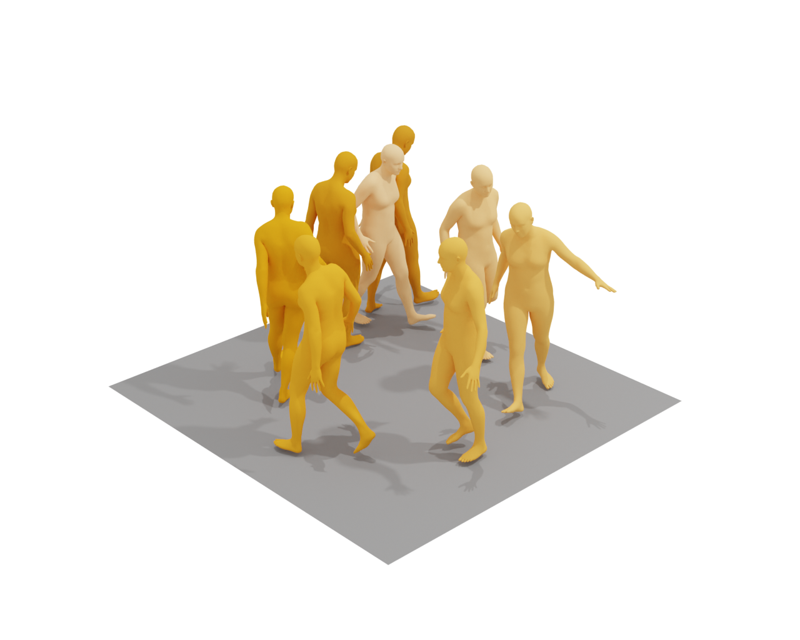
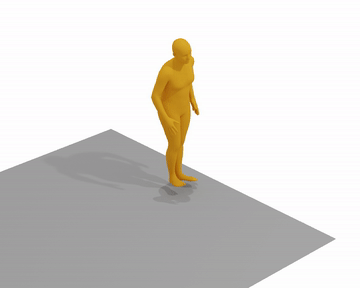
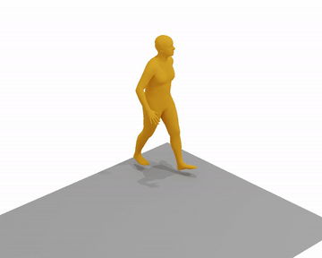
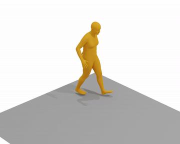

<h1 align="center"><strong>FineXtrol: Controllable Motion Generation via Fine-Grained Text</strong></h1>
  <p align="center">
    <a href='https://scholar.google.com/citations?hl=zh-CN&authuser=1&user=e5YyAxcAAAAJ' target='_blank'>Keming Shen</a><sup>1,2</sup>&emsp;
    Bizhu Wu</a><sup>1,2,3</sup>&emsp;
    Junliang Chen</a><sup>4</sup>&emsp;
    Xiaoqin Wang</a><sup>1,2</sup>&emsp;
    Linlin Shen</a>*<sup>1,2,5</sup>&emsp;
    <br>
    <sup>1</sup>School of Computer Science and Software Engineering, Shenzhen University<br>
    <sup>2</sup>Guangdong Provincial Key Laboratory of Intelligent Information Processing<br>
    <sup>3</sup>University of Nottingham Ningbo China&emsp;
    <sup>4</sup>The Hong Kong Polytechnic University<br>
    <sup>5</sup>Computer Vision Institute, School of Artificial Intelligence, Shenzhen University
    <br>
    *Indicates Corresponding Author
</p>
</p>

<p align="center">
  <!-- <a href="https://neurips.cc/virtual/2025/poster/118773">
    
  </a> -->
  <a href="https://arxiv.org/abs/2511.18927">
    
  </a>
  <a href="https://lucky1192405754.github.io/projects/FineXtrol/">
    
  </a>
</p>

</div>
How to achieve **precise** spatial-temporal control in motion generation using only **natural language**?

> **TL;DR:** We propose **FineXtrol**, a novel control framework that utilizes *fine-grained textual control signals* (e.g., "Straighten your left leg in 1.0-1.5s") to guide motion generation. By combining a **Dual-Branch ControlNet** architecture with a **Hierarchical Contrastive Learning** module, FineXtrol enables precise control over specific body parts within designated temporal intervals, offering a more user-friendly and efficient alternative to spatial coordinate-based methods.

<div align="center">
    
</div>

## 📣 News
- **[2025/11]** Our paper "FineXtrol" has been accepted by **AAAI 2026**! 🎉
- **[2025/11]** The [Project Page](https://lucky1192405754.github.io/projects/FineXtrol/) is now live.
- **[2025/11]** The paper is available on [ArXiv](https://arxiv.org/abs/2511.18927).

## 📆 Plan
- [x] Release paper and project page.
- [x] Release the **FineMotion** dataset processing scripts.
- [x] Release **FineXtrol** code:
  - [x] Environment setup guidance.
  - [x] Inference scripts (Pretrained models).
  - [x] Training scripts (Hierarchical Contrastive Learning & Diffusion).
  - [x] Evaluation metrics.

## 🛠️ Getting Started

This repository contains the lightweight code for training, inference, evaluation, and visualization of FineXtrol. Large files such as datasets, model checkpoints, SMPL assets, and generated videos are not tracked in Git and should be downloaded separately.

### 1. Setup environment

FineXtrol follows the same basic environment setup as MDM/OmniControl. We recommend using conda with Python 3.7 and a CUDA-capable GPU.

Install `ffmpeg` if it is not already available:

```bash
sudo apt update
sudo apt install ffmpeg
```

Create and activate the environment:

```bash
conda env create -f environment.yml
conda activate finextrol
python -m spacy download en_core_web_sm
pip install git+https://github.com/openai/CLIP.git
```

If your local environment file differs, please make sure the following core packages are installed: PyTorch, NumPy, SciPy, scikit-learn, spaCy, transformers, sentencepiece, trimesh, smplx, chumpy, blobfile, gdown, and OpenAI CLIP.

### 2. Download required assets

Download the common MDM/OmniControl assets:

```bash
bash prepare/download_smpl_files.sh
bash prepare/download_glove.sh
bash prepare/download_t2m_evaluators.sh
```

FineXtrol additionally uses a local T5-base encoder. Download it with:

```bash
python download_t5_base.py
```

After downloading, the expected lightweight/external asset layout is:

```text
FineXtrol/
├── body_models/                         # SMPL files for SMPLify/joints2smpl, external download
├── deps/smpl_models/                    # SMPL/SMPLH assets used by Blender rendering
├── dataset/
│   ├── HumanML3D/                       # HumanML3D dataset, external download
│   └── 0121_operated_mirror_ori_humanml3d_posefix_annotations_interval0.5_pose_change_th1.0_modified.json
├── detailed_text_encoder/
│   └── T5_base_sequence_MLP_0402.pt     # Fine-tuned detailed-text encoder checkpoint
├── glove/                               # Text vectorizer assets
├── save/
│   ├── model000475000.pt                # Pretrained MDM checkpoint for training initialization
│   └── 0613_random_FineXtrol_bs256/
│       └── model001275090.pt            # FineXtrol checkpoint
├── t5-base-local/                       # Downloaded by download_t5_base.py
└── text_mot_match/                      # T2M evaluator checkpoints
```

The FineXtrol checkpoint, fine-tuned T5 encoder, and fine-grained annotation JSON will be provided as external downloads. Please place them at the paths shown above, or update the corresponding paths in the scripts.

### 3. Prepare datasets

Please follow [HumanML3D](https://github.com/EricGuo5513/HumanML3D) to download and prepare the HumanML3D dataset and put it under the `dataset` directory like:

```text
./dataset/HumanML3D/
├── new_joint_vecs/
├── texts/
├── Mean.npy    # same as in [HumanML3D](https://github.com/EricGuo5513/HumanML3D)
├── Std.npy     # same as in [HumanML3D](https://github.com/EricGuo5513/HumanML3D)
├── train.txt
├── val.txt
├── test.txt
├── train_val.txt
└── all.txt
```

FineXtrol training requires the fine-grained text annotation file under `./dataset/`. The current default path used by the dataloader is:

```text
./dataset/0121_operated_mirror_ori_humanml3d_posefix_annotations_interval0.5_pose_change_th1.0_modified.json
```

### 4. Download pretrained models

FineXtrol training starts from the pretrained MDM HumanML3D checkpoint. Place it under `./save/`, for example:

```text
./save/model000475000.pt
```

For inference and evaluation, place the released FineXtrol checkpoint at:

```text
./save/0613_random_FineXtrol_bs256/model001275090.pt
```

The detailed-text T5 encoder checkpoint should be placed at:

```text
./detailed_text_encoder/T5_base_sequence_MLP_0402.pt
```

## Motion Synthesis

Generate motion with the released FineXtrol checkpoint:

```bash
python -m sample.generate \
  --model_path ./save/0613_random_FineXtrol_bs256/model001275090.pt \
  --text_prompt "A person walks in a clockwise circle." \
  --detailed_text_prompt "<SEP> <Motionless> <SEP> Move your left leg back slightly. <SEP> <Motionless> <SEP> Move your left leg forward." \
  --num_samples 1 \
  --num_repetitions 1
```

The script writes generated results to the output directory, including:

- `results.npy`: generated motion data and text prompts.
- `sample##_rep##.mp4`: stick-figure motion visualization.
- `sample##_rep##.txt`: text prompts used for generation.

FineXtrol uses both coarse text and fine-grained textual control. Use `--text_prompt` for the coarse motion description and `--detailed_text_prompt` for fine-grained body-part control. The detailed prompt should use `<SEP>` to separate temporal snippets, and may use `<Motionless>` or `<Mask>` when a snippet has no active control.

## Render SMPL Mesh

FineXtrol supports both MDM-style SMPL conversion and MotionLCM/Blender-style mesh rendering.

### Option A: Convert a stick-figure result to SMPL mesh

```bash
python -m visualize.render_mesh --input_path /path/to/sample##_rep##.mp4
```

This produces SMPL parameters and mesh files next to the input animation.

### Option B: Render mesh images or videos with Blender/MotionLCM

Install Blender and replace `YOUR_BLENDER_PATH` with your local Blender executable path.

Render a sequence of mesh images:

```bash
YOUR_BLENDER_PATH/blender --background --python Motionlcm/render.py -- \
  --pkl assets/example_mesh.pkl \
  --mode sequence \
  --num 8
```

Render a mesh video:

```bash
YOUR_BLENDER_PATH/blender --background --python Motionlcm/render.py -- \
  --pkl assets/example_mesh.pkl \
  --mode video \
  --fps 20
```

The Blender renderer expects a mesh `.pkl` file and SMPL faces. By default, the renderer uses:

```text
./deps/smpl_models/smplh/smplh.faces
```

If your SMPL assets are stored elsewhere, pass `--faces_path` to the render script.

### Visualization demos

The examples below use the same coarse-grained text prompt with different fine-grained control settings.

**Coarse-Grained Text:** A person walks in a clockwise circle.

| Coarse text only | Left-leg control | Multi-body-part control |
| --- | --- | --- |
|  |  |  |
| No fine-grained control. | 1.0-1.5s: Move your left leg back slightly.<br>3.0-3.5s: Move your left leg forward. | 1.0-1.5s: Straighten your left arm.<br>1.5-2.0s: Bend your right knee more.<br>2.5-3.0s: Move your left leg forward. |
|  |  |  |

## Train your own FineXtrol

Train FineXtrol on the detailed-text dataset:

```bash
python -m train.train_mdm \
  --save_dir save/my_fineXtrol \
  --dataset detailed_text \
  --num_steps 400000 \
  --batch_size 64 \
  --resume_checkpoint ./save/model000475000.pt \
  --lr 1e-5
```

The training script saves checkpoints, optimizer states, and `args.json` under `--save_dir`.

## Evaluate

Evaluate the released FineXtrol checkpoint with the HumanML3D/T2M metrics:

```bash
python -m eval.eval_humanml \
  --model_path ./save/0613_random_FineXtrol_bs256/model001275090.pt \
  --eval_mode finextrol \
  --eval_part "left leg" \
  --mask_ratio 0.5
```

For body-part or cross-body-part fine-grained control evaluation, use:

```bash
python -m eval.eval_humanml_loop \
  --model_path ./save/0613_random_FineXtrol_bs256/model001275090.pt \
  --eval_parts "head" "body" "left hand" "right hand" "left leg" "right leg" \
  --mask_ratio 0.5

python -m eval.eval_humanml_loop_cross \
  --model_path ./save/0613_random_FineXtrol_bs256/model001275090.pt \
  --cross_k 2 \
  --mask_ratio 0.5
```

`eval_humanml_loop.py` evaluates one or more specified body parts, while `eval_humanml_loop_cross.py` evaluates body-part combinations of size `--cross_k`.

## Code Pointers

- FineXtrol model: `model/cmdm.py`
- Diffusion training losses and sampling: `diffusion/gaussian_diffusion.py`
- Training entrypoint: `train/train_mdm.py`
- Inference entrypoint: `sample/generate.py`
- Evaluation scripts: `eval/`
- Fine-grained text dataloader: `data_loaders/humanml/data/dataset.py`
- Blender/MotionLCM renderer: `Motionlcm/render.py`

## Acknowledgement

This work is built on many amazing research works and open-source projects, thanks a lot to all the authors for sharing!

- https://github.com/GuyTevet/motion-diffusion-model
- https://github.com/BizhuWu/FineMotion
- https://github.com/neu-vi/OmniControl
- https://github.com/Dai-Wenxun/MotionLCM

## Citation

If you find FineXtrol helpful for your research, please consider citing the paper and starring the repo ⭐.

```bibtex
@article{Shen_Wu_Chen_Wang_Shen_2026,
  title         = {FineXtrol: Controllable Motion Generation via Fine-Grained Text},
  author        = {Shen, Keming and Wu, Bizhu and Chen, Junliang and Wang, Xiaoqin and Shen, Linlin},
  journal       = {Proceedings of the AAAI Conference on Artificial Intelligence},
  volume        = {40},
  number        = {11},
  pages         = {8905--8913},
  year          = {2026},
  month         = {Mar.},
  doi           = {10.1609/aaai.v40i11.37845},
  url           = {https://ojs.aaai.org/index.php/AAAI/article/view/37845}
}
```
